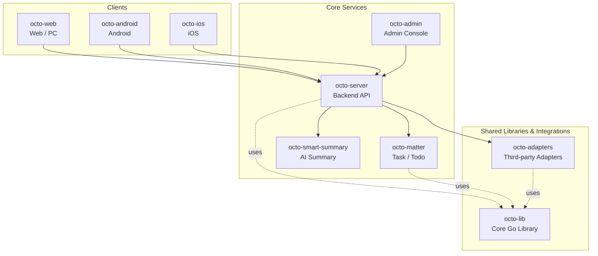

<p align="center">
  
  
</p>

<p align="center">
  <b>OCTO — the open workplace built for humans × AI agents.</b><br/>
  <sub>Let <b>Lobsters</b> (OpenClaw-powered digital doubles) do the <i>thinking</i> and <i>doing</i>. You focus on <i>taste</i>.</sub>
</p>

<p align="center">
  <a href="https://github.com/Mininglamp-OSS"><b>🏠 OCTO Home</b></a> ·
  <a href="#-quickstart"><b>🚀 Quickstart</b></a> ·
  <a href="#-octo-ecosystem"><b>📦 Ecosystem</b></a> ·
  <a href="./CONTRIBUTING.md"><b>🤝 Contributing</b></a>
</p>

<p align="center">
  <a href="./LICENSE"></a>
  <a href="./README.zh.md"></a>
</p>

---

> 🌐 **Read in**: **English** · [简体中文](README.zh.md)

# OCTO Adapters

> **Third-party integrations** for OCTO — bridge your chat stack, AI providers, and data sources into Lobster-addressable surfaces.

Every adapter in this repo is a self-contained module that can be enabled or
disabled independently. Adapters connect OCTO to external systems — other IM
platforms (Slack, Discord, 飞书, Telegram), AI providers (OpenAI, Anthropic,
Claude Agent SDK, OpenClaw channels), productivity tools, and webhook sinks —
so Lobster agents can reach a user wherever the user already is.

## 🌟 Why OCTO Adapters

- **Plug, don't patch.** Drop an adapter in, configure credentials, restart — no core-server fork, no schema surgery. Adapters are loaded at boot from `octo-server`'s config.
- **Polyglot on purpose.** Adapters live side-by-side in TypeScript (Node) and Python. Pick the language that matches the upstream SDK — this repo is the meeting point.
- **Lobster-native.** Every adapter exposes the same OCTO-internal envelope (channel id + message + agent context), so Lobster agents can switch transports without learning each vendor's quirks.

## 🚀 Quickstart

```bash
git clone https://github.com/Mininglamp-OSS/octo-adapters.git
cd octo-adapters

# Node adapters — see ./packages for the current list
pnpm install
pnpm --filter <adapter-name> dev

# Python adapters
cd <adapter-dir> && pip install -e .
python -m <adapter_module>.cli
```

Each adapter has its own `README.md` under its package directory with
credentials setup and a minimal run recipe. Start from that README, not this
root.

## 📦 Modules / Architecture

This release bundles three reference adapter families (see individual package
directories for the canonical package name and CLI entry point):

| Family | Language | Purpose |
|---|---|---|
| **Claude Agent SDK gateway** | TypeScript (Node) | WebSocket gateway connecting the Claude Agent SDK to the OCTO IM protocol. Handles DH key exchange, AES-CBC framing, streaming replies, DM + group delivery, session persistence, auto-reconnect. |
| **OpenClaw channel** | TypeScript (Node) | OpenClaw AI framework channel plugin over the OCTO IM WebSocket protocol. Real-time receive, auto-reconnect, streaming, typing indicator, read receipts, multi-account isolation. |
| **Hermes Agent channel** | Python | Hermes Agent adapter for the OCTO IM platform (multi-account, protocol + integration layer). |

Each adapter implements the same high-level lifecycle:

1. **Connect** to the upstream transport (WebSocket, HTTP long-poll, gRPC).
2. **Authenticate** — DH + AES if using OCTO IM's secure framing, OAuth / bearer otherwise.
3. **Route** inbound messages into the OCTO-internal envelope.
4. **Dispatch** outbound messages from Lobster agents back to the upstream.
5. **Recover** — exponential back-off reconnect, idempotent message IDs, session resume.

## 🔗 OCTO Ecosystem

<!-- shared snippet: OCTO repo matrix. Keep identical across all 9 repos. -->



| Repository | Language | Role |
|---|---|---|
| [`octo-server`](https://github.com/Mininglamp-OSS/octo-server) | Go | Backend API · business orchestration · Lobster agent scheduling |
| [`octo-matter`](https://github.com/Mininglamp-OSS/octo-matter) | Go | Task / Todo / Matter micro-service |
| [`octo-smart-summary`](https://github.com/Mininglamp-OSS/octo-smart-summary) | Go | LLM-powered conversation summarisation |
| [`octo-web`](https://github.com/Mininglamp-OSS/octo-web) | TypeScript / React | Web & PC (Electron) client |
| [`octo-android`](https://github.com/Mininglamp-OSS/octo-android) | Kotlin / Java | Native Android client |
| [`octo-ios`](https://github.com/Mininglamp-OSS/octo-ios) | Swift / Objective-C | Native iOS client |
| [`octo-admin`](https://github.com/Mininglamp-OSS/octo-admin) | TypeScript / React | Admin console (tenant / org / user / channel management) |
| [`octo-lib`](https://github.com/Mininglamp-OSS/octo-lib) | Go | Shared core library (protocol, crypto, storage, HTTP) |
| [`octo-adapters`](https://github.com/Mininglamp-OSS/octo-adapters) | TypeScript / Python | Third-party integrations (IM bridges, AI channels) |

## 🧭 Philosophy

OCTO ships under three shared principles that apply to every repository in this matrix:

1. **Local-first.** Anything that can run on the user's own box — chats, embeddings, agents — should. Your data stays yours; cloud is a choice, not a requirement.
2. **Humans judge, AI thinks and acts.** Humans focus on *taste* (what matters, what's right, what to ship). Lobster agents — OpenClaw-powered digital doubles — carry the *thinking* and *execution* load.
3. **Release-as-product.** Every open-source cut is shipped as a self-contained product, not a code dump: one squash per release, Apache 2.0, no internal baggage, reproducible from this repo alone.

## 🤝 Contributing

We love pull requests! Before you open one, please read:

- [CONTRIBUTING.md](CONTRIBUTING.md) — workflow, branch model, commit style
- [CODE_OF_CONDUCT.md](CODE_OF_CONDUCT.md) — community expectations

If you're writing a new adapter, please see `docs/ADAPTER-AUTHORING.md` _(coming soon)_ for the integration contract and directory layout.

For security issues please follow [SECURITY.md](SECURITY.md) instead of the public tracker.

## 📄 License

Apache License 2.0 — see [LICENSE](LICENSE) for the full text and [NOTICE](NOTICE) for third-party attributions.

---

<p align="center">
  <sub>Made with 🐙 by <b>OCTO Contributors</b> · <a href="https://github.com/Mininglamp-OSS">Mininglamp-OSS</a></sub>
</p>
