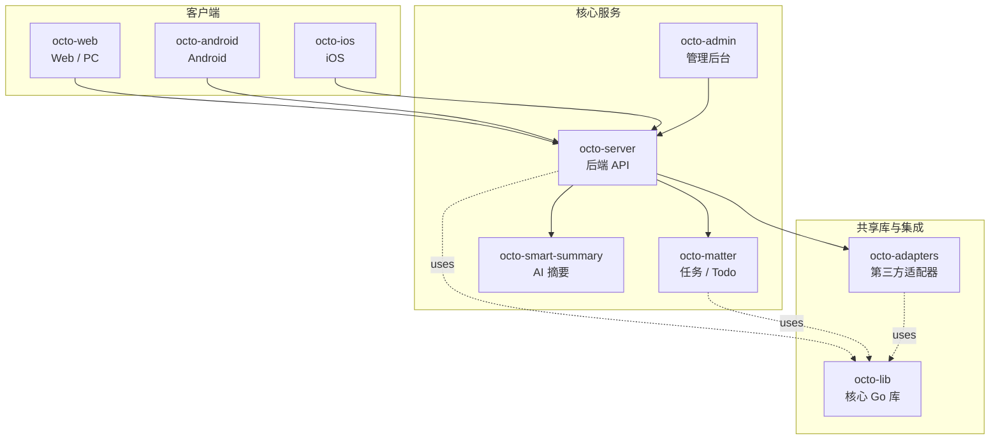

<p align="center">
  
  
</p>

<p align="center">
  <b>OCTO —— 为人和 AI Agent 协作而生的开源工作平台。</b><br/>
  <sub>让 <b>龙虾（Lobster / OpenClaw-powered digital double agents）</b>去「思」和「行」，让人专注于「品」。</sub>
</p>

<p align="center">
  <a href="https://github.com/Mininglamp-OSS"><b>🏠 OCTO 主页</b></a> ·
  <a href="#-快速开始"><b>🚀 快速开始</b></a> ·
  <a href="#-octo-生态"><b>📦 生态</b></a> ·
  <a href="./CONTRIBUTING.zh.md"><b>🤝 贡献</b></a>
</p>

<p align="center">
  <a href="./LICENSE"></a>
  <a href="./README.md"></a>
</p>

---

> 🌐 **语言**: [English](README.md) · **简体中文**

# OCTO Adapters（简体中文）

> **第三方集成适配器** —— 把你的聊天平台、AI 提供方、数据源桥接进 OCTO，让龙虾触达用户所在的任意通道。

本仓中的每个 adapter 都是自包含的独立模块，可以独立启停。Adapter 负责把 OCTO
与外部系统打通 —— 其他 IM 平台（Slack、Discord、飞书、Telegram）、AI 提供方
（OpenAI、Anthropic、Claude Agent SDK、OpenClaw channels）、生产力工具、
Webhook 出口 —— 让龙虾可以在用户已经在用的平台上直接触达用户。

## 🌟 为什么选 OCTO Adapters

- **即插即用，不 fork。** 丢一个 adapter 进来，配好凭据，重启即可 —— 不 fork 核心服务，也不改 schema。Adapter 由 `octo-server` 在启动时从配置加载。
- **多语言共存是设计选择。** adapter 以 TypeScript（Node）和 Python 并行存在；选哪种语言取决于上游 SDK 的官方语言，这个仓就是会合点。
- **龙虾原生。** 每个 adapter 对外暴露统一的 OCTO 内部信封（频道 id + 消息体 + agent context），所以龙虾切换传输通道时无需再学每家平台的特殊用法。

## 🚀 快速开始

```bash
git clone https://github.com/Mininglamp-OSS/octo-adapters.git
cd octo-adapters

# Node 类 adapter（当前清单见 ./packages）
pnpm install
pnpm --filter <adapter-name> dev

# Python 类 adapter
cd <adapter-dir> && pip install -e .
python -m <adapter_module>.cli
```

每个 adapter 都有独立的 `README.md`（位于各自的包目录下），里面包含凭据配置
与最小运行示例。请从各 adapter 自己的 README 开始看，而不是这个根 README。

## 📦 模块与架构

本次 release 捆绑了三类参考 adapter（具体包名与 CLI 入口见各自的包目录）：

| 家族 | 语言 | 作用 |
|---|---|---|
| **Claude Agent SDK 网关** | TypeScript (Node) | 把 Claude Agent SDK 接到 OCTO IM 协议的 WebSocket 网关。负责 DH 密钥交换、AES-CBC 分帧、流式回复、DM + 群发、会话持久化、自动重连。 |
| **OpenClaw channel** | TypeScript (Node) | OpenClaw AI 框架 channel 插件，基于 OCTO IM WebSocket 协议。实时收发、自动重连、流式、输入提示、已读回执、多账号隔离。 |
| **Hermes Agent channel** | Python | Hermes Agent 在 OCTO IM 平台上的适配器（多账号、协议 + 集成层）。 |

所有 adapter 实现同一套高层生命周期：

1. **Connect** 连接上游传输（WebSocket / HTTP long-poll / gRPC）。
2. **Authenticate** 认证 —— 如果使用 OCTO IM 安全分帧则走 DH + AES，否则走 OAuth / bearer。
3. **Route** 把入站消息路由成 OCTO 内部信封。
4. **Dispatch** 把龙虾产生的出站消息下发回上游。
5. **Recover** 指数退避重连、幂等消息 ID、会话续接。

## 🔗 OCTO 生态

<!-- 共享片段：OCTO 仓库矩阵。9 个仓库之间保持一致。 -->



| 仓库 | 语言 | 职责 |
|---|---|---|
| [`octo-server`](https://github.com/Mininglamp-OSS/octo-server) | Go | 后端 API · 业务编排 · 龙虾 Agent 调度 |
| [`octo-matter`](https://github.com/Mininglamp-OSS/octo-matter) | Go | 任务 / Todo / Matter 微服务 |
| [`octo-smart-summary`](https://github.com/Mininglamp-OSS/octo-smart-summary) | Go | 基于 LLM 的会话摘要服务 |
| [`octo-web`](https://github.com/Mininglamp-OSS/octo-web) | TypeScript / React | Web 与 PC（Electron）客户端 |
| [`octo-android`](https://github.com/Mininglamp-OSS/octo-android) | Kotlin / Java | 原生 Android 客户端 |
| [`octo-ios`](https://github.com/Mininglamp-OSS/octo-ios) | Swift / Objective-C | 原生 iOS 客户端 |
| [`octo-admin`](https://github.com/Mininglamp-OSS/octo-admin) | TypeScript / React | 管理后台（租户 / 组织 / 用户 / 频道管理） |
| [`octo-lib`](https://github.com/Mininglamp-OSS/octo-lib) | Go | 共享核心库（协议 / 加密 / 存储 / HTTP） |
| [`octo-adapters`](https://github.com/Mininglamp-OSS/octo-adapters) | TypeScript / Python | 第三方集成（IM 桥接、AI 渠道） |

## 🧭 设计哲学

OCTO 遵循三条共用原则 —— 这套矩阵里的每个仓都一致：

1. **本地优先（Local-first）。** 能跑在用户本机的一切（对话、向量、智能体）都应尽量在本机完成。你的数据属于你；云是可选项，不是前置条件。
2. **人做「品」，AI 做「思」与「行」。** 人聚焦在品味（什么重要、什么对、该发什么）。龙虾（OpenClaw 驱动的数字分身）承担思考与执行。
3. **Release-as-product（每次发布即产品）。** 每一次开源切片都是一个自洽的产品，不是代码倾倒：一个 release 一次 squash，Apache 2.0，不夹带内部包袱，单仓即可复现。

## 🤝 贡献

欢迎提 Pull Request！开 PR 前请先读：

- [CONTRIBUTING.zh.md](CONTRIBUTING.zh.md) —— 工作流、分支模型、commit 规范
- [CODE_OF_CONDUCT.zh.md](CODE_OF_CONDUCT.zh.md) —— 社区行为准则

如果你在写新 adapter，请参考 `docs/ADAPTER-AUTHORING.md` _(建设中)_ 了解集成契约与目录结构。

安全问题请按 [SECURITY.zh.md](SECURITY.zh.md) 上报，不要走公开 issue。

## 📄 许可

Apache License 2.0 —— 完整文本见 [LICENSE](LICENSE)，第三方致谢见 [NOTICE](NOTICE)。

---

<p align="center">
  <sub>由 <b>OCTO Contributors</b> 🐙 共同开发 · <a href="https://github.com/Mininglamp-OSS">Mininglamp-OSS</a></sub>
</p>
